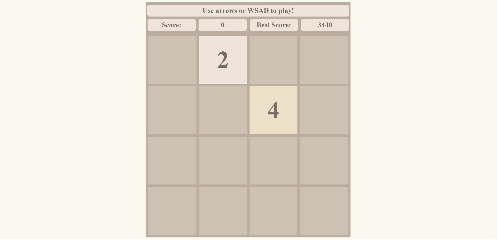
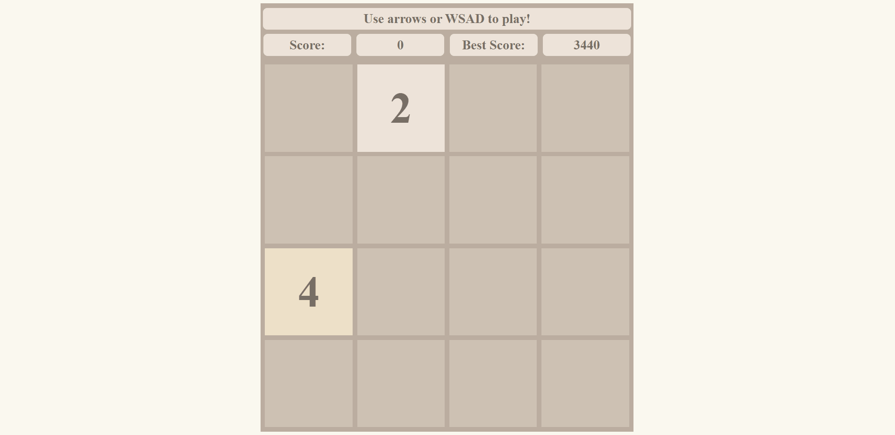

# 2048

Simple implementation of 2048 game done with plain HTML, CSS, and JavaScript.

## Motivation

Used to learn:

- DOM manipulation
- Object-oriented programming
- CSS variables

## Usage

Run the application in a modern browser.

## Demo

[Try it out!](https://thesoban.github.io/2048/)

